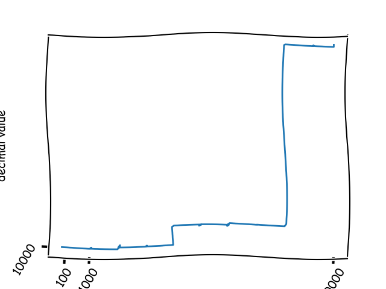

# Binary and Decimals

Written because one day I realised that all binary numbers could be read as decimal

eg. 101 is both 5 and one hundred and one, then wondered what the relationship between them was like.

I'll come back to this some day, lodging here almost as a reminder.  The graphs are ugly.

